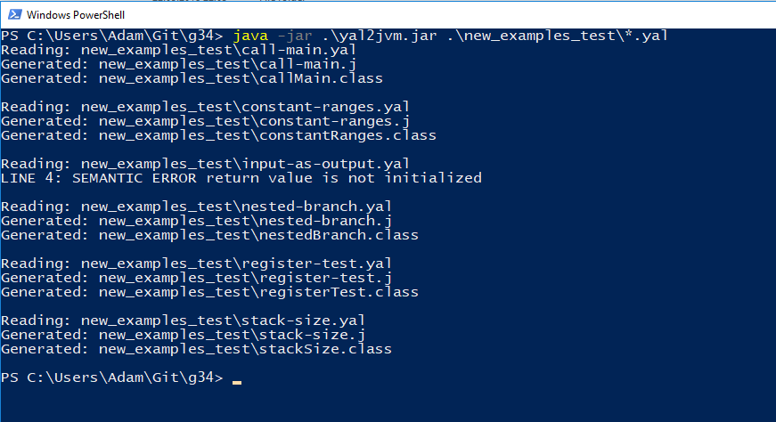

### What is done ###

## First checkpoint ##
- parser of LL(1) type
- error treatment and recovery mechanisms
- AST
## Second checkpoint ##
- semantic analysis
	- symbol table
- code generation
	- invocation of functions
	- arithmetic expressions
	- conditional instructions
	- loops
	- arrays
	- stack size calculation

## Third checkpoint ##
- semantic analysis
	- fixes
- code generation
	- fixes
- optimization
	- constant folding
	- constant propagation
	- dead code removal
## Usage ##

-o	optimization

## Examples ###
 
Semantic analysis

~~~
#!java
function main() {
	a = 1;
	if(a>3){
		b = 2;
	}
	else{
		if(a>4){
			b = 4;
		}
		else{
			b = 5;
		}
	}
	c = b; //ERROR - b is undeclared
	while(a>3){
		a = a+1;
	}
}
~~~
