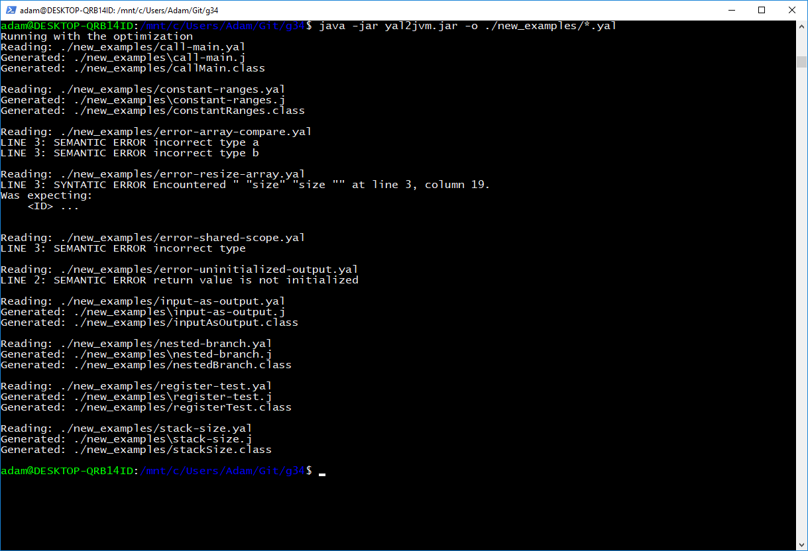

### What is done ###

## First checkpoint ##
- parser of LL(1) type
- error treatment and recovery mechanisms
- AST
## Second checkpoint ##
- semantic analysis
	- symbol table
- code generation
	- invocation of functions
	- arithmetic expressions
	- conditional instructions
	- loops
	- arrays
	- stack size calculation

## Third checkpoint ##
- semantic analysis
	- fixes
- code generation
	- fixes
- optimization
	- constant folding
	- constant propagation
	- dead code removal
- register alocation
	- left edge algorithm

## Final delivery ##
- fixes
- optimization
	- operators optimization: (x*2 -> x+x)
	- loops templates
- register alocation
	- graph coloring

## Usage ##

-o	optimization
-r register alocation (left edge algorithm)

## Examples ###
 
### Semantic analysis ###
#
~~~
#!java
function main() {
	a = 1;
	if(a>3){
		b = 2;
	}
	else{
		if(a>4){
			b = 4;
		}
		else{
			b = 5;
		}
	}
	c = b; //ERROR - b is undeclared
	while(a>3){
		a = a+1;
	}
}
~~~
### Optimization ###
----
~~~
#!java
  function a=example1(a,b) {
    a = 0;
    a = b;   	 
  }
~~~
---
~~~
#!java
.method public static example1(II)I
.limit locals 2
.limit stack 1
   iload_0
  ireturn
.end method
~~~
---
~~~
#!java
  function r=example2(a,b) {
    a = 2;
    b = 4;
    c = a * b;
    r = 0;
  }
~~~
---
~~~
#!java
.method public static example2(II)I
.limit locals 2
.limit stack 1
   iconst_0
  ireturn
.end method
~~~
---
~~~
#!java
  function r=example3(a,b) {
    a = 2;
    b = 4;
    c = a * b;
    d = 2;
    r = c + d;       
  }
~~~
---
~~~
#!java
.method public static example3(II)I
.limit locals 2
.limit stack 1
   bipush 10
  ireturn
.end method
~~~
---
~~~
#!java
  function a=example4(a,b) {
    a = 2;
    a = a + 1;
    a = a + 2;
    a = a + 3;
  }
~~~
---
~~~
#!java
.method public static example4(II)I
.limit locals 2
.limit stack 1
   bipush 8
  ireturn
.end method
~~~
---
~~~
#!java
  function r=deadCodeExample1(a,b) {
    r = 0;
    a = 1;
    b = 2;
    if(a>b){
    	r = 70;
    }
  }
~~~
---
~~~
#!java
.method public static deadCodeExample1(II)I
.limit locals 2
.limit stack 1
   iconst_0
  ireturn
.end method
~~~
---
~~~
#!java
  function r=deadCodeExample2(a,b) {
    r = 0;
    a = 1;
    b = 2;
    if(a<b){
    	r = 70;
    }
  }
~~~
---
~~~
#!java
.method public static deadCodeExample2(II)I
.limit locals 2
.limit stack 1
   bipush 70
  ireturn
.end method
~~~
---
~~~
#!java
  function r=deadCodeExample3(a,b) {
    r = 0;
    x = 1;
    a = x;
    if(a>2){
    	r = 70;
    } else{
    	r = -1;
    }
  }
~~~
---
~~~
#!java
.method public static deadCodeExample3(II)I
.limit locals 2
.limit stack 1
   iconst_m1
  ireturn
.end method
~~~
---
~~~
#!java
  function r=deadCodeExample4(a,b) {
    r = 2;
    a = 0;
    while(a>r){
    	r = 70;
    } 
  }
~~~
---
~~~
#!java
.method public static deadCodeExample4(II)I
.limit locals 2
.limit stack 1
   iconst_2
  ireturn
.end method
~~~
---
~~~
#!java
  function r=mixedExample() {
    a = 2*3;
    b = a+9;
    if(a>b){
      r = -1;
    } else{
    	r = 2;
        while(a<=r){
    	  r = 70;
        }
        if(a>r){
          r = 1;
        }
    } 
  }
~~~
---
~~~
#!java
.method public static mixedExample()I
.limit locals 0
.limit stack 1
   iconst_1
  ireturn
.end method
~~~
---